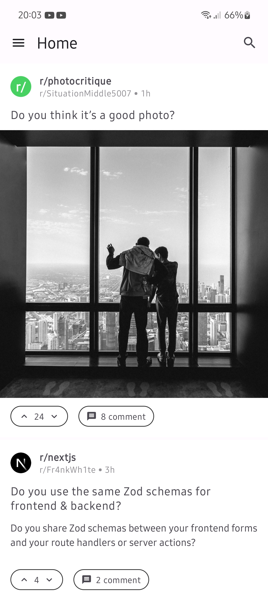
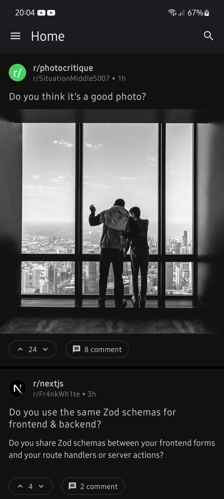
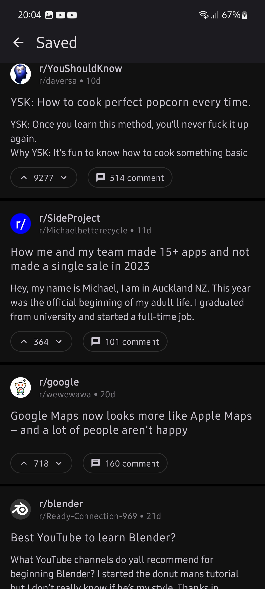
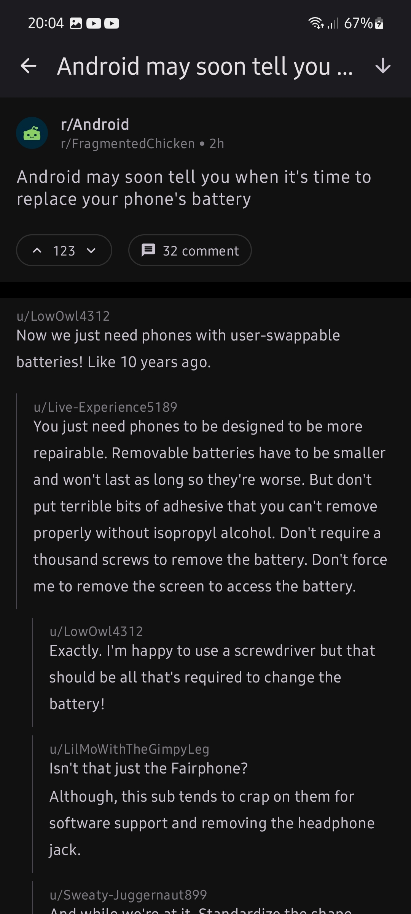

# Reddit Client

This is a Reddit client Android app developed as a learning project for native Android development.
While it's not yet complete, it provides basic functionality to interact with Reddit.

Because it's a learning project, it doesn't follow patterns as they should, and doesn't implement
any testing so I don't recommend this repo to anyone that wants to start learning android.

## Features

- **Login and Authentication:** Users can log in using their Reddit credentials.
- **Browse Home Feed:** View popular posts.
- **Read Posts:** Read posts from selected subreddits.
- **Browse Saved Posts**
- **Scroll to next comment button**
- **Zooming on images similar to instagram**

## Screenshots

|  |  |  |  |
|:---------------------------------------------:|:---------------------------------------------:|:---------------------------------------------:|:---------------------------------------------:|
|           *Home Screen Light mode*            |            *Home Screen Dark mode*            |             *Saved Posts Screen*              |            *Post Comments Screen*             |


## Installation

1. Clone the repository:

    ```bash
    git clone https://github.com/elfennani/Readit-android.git
    ```

2. Open the project in Android Studio.

3. Build and run the app on an emulator or physical device.

## Usage

1. Launch the app.
2. Log in with your Reddit account.
3. Browse and read posts.

## Known Issues

- Reddit's markdown flavour is not implemented but can be
- Voting and commenting is implemented yet
- Error states were not handled instead the app crashes

## Acknowledgments

- The markdown composable was copied
  from [ErikHellman/MarkdownComposer](https://github.com/ErikHellman/MarkdownComposer) although it's
  a bit modified

## Contact

If you have questions or feedback, feel free to reach out at [elfennani2002@gmail.com].

